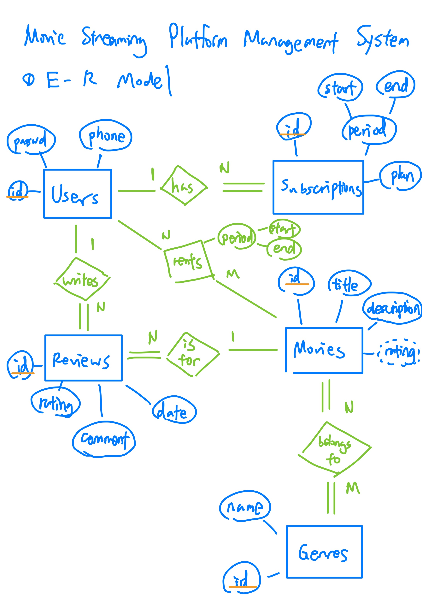
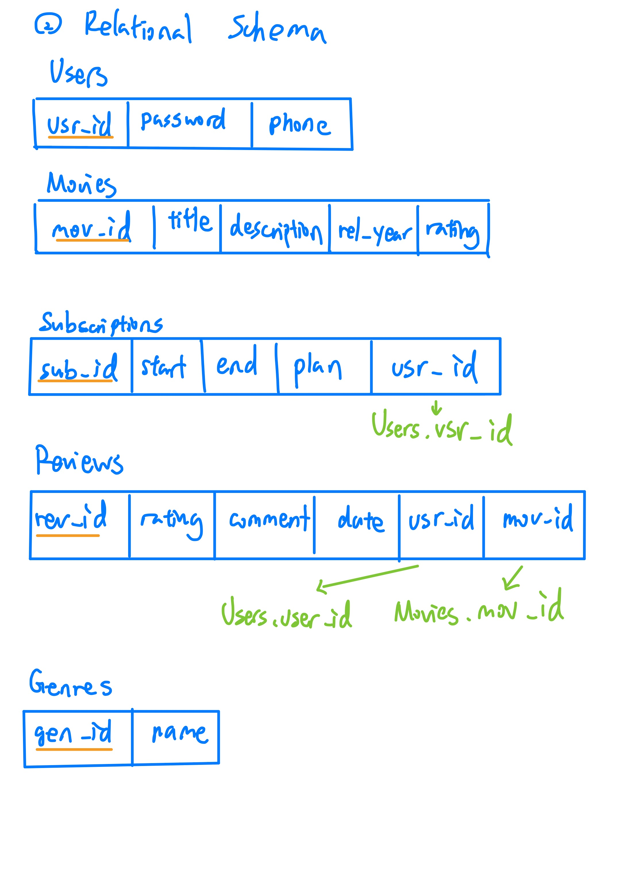
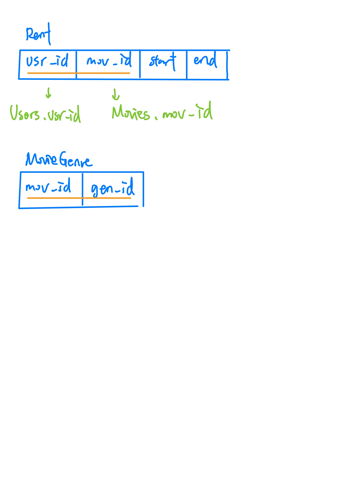

# Movie Streaming Platform Management System
This repo is my final project for the course "Database Systems" in NCCU.

## Caveat
Please note that code in this repo is intended solely for demo purposes and is susceptible to various bugs. Please DO NOT use it in practice!

## E-R Diagram


## Relational Schema



## Running the Project from Scratch

**Prerequisites:**
- Python 3.x
- pip

To get the project up and running, follow these steps:

1. **Clone the Repository:**
   ```sh
   git clone <repository_url>
   cd <repository_name>
   ```
2. **Install Dependencies:**
Install the required packages from requirements.txt.
```sh
pip install -r requirements.txt
```
3. **Initialize the Database:**
Run the following commands to set up the database.
```sh
flask db init
flask db migrate -m "Initial migration"
flask db upgrade
```
4. **Run the Application:**
Start the Flask application.
```sh
flask run
```
Now, you should be able to access the application at http://127.0.0.1:5000 and the admin panel at http://127.0.0.1:5000/admin?admin_key=your_admin_key_here (replace your_admin_key_here with your custom admin key).
For more information, please read the [docs](./docs)


## System Function Analysis
The system provides the following key functionalities:

**User Management**
- **Registration**: New users can register by providing necessary details such as username, password, and phone number. The system ensures that the username is unique and provides feedback if the username is already taken or if the password confirmation does not match.
- **Authentication**: Users can log in using their username and password. Passwords are securely hashed for storage and verification.
- **Profile Management**: Users can update their profile details, including their phone number, by providing their current password for verification.
- **Password Management**: Users can update their passwords by providing their current password and confirming the new password.

**Movie Management**
- **Add New Movies**: Admins can add new movies with details like title, description, release year, and genres.
- **Update Movie Details**: Admins can update movie information, including changing the assigned genres.
- **Delete Movies**: Admins can remove movies from the database, and associated reviews and rentals are also deleted.

**Subscription Management**
- **Subscribe**: Users can subscribe to different plans, choosing between 1-month and 1-year options.
- **View Subscriptions**: Users can view their current subscriptions to keep track of their active subscriptions.
- **Cancel Subscription**: Users can cancel their ongoing subscriptions if needed.

**Rental Management**
- **Rent Movies**: Users can rent movies by specifying the end date.
- **View Rentals**: Users can view their current rentals, including the start and end dates, and the movies they have rented.

**Review Management**
- **Add Reviews**: Users can review movies by providing a rating and comment. The system prevents users from adding multiple reviews for the same movie.
- **Edit Reviews**: Users can update their existing reviews through a dedicated update review page.
- **Delete Reviews**: Users can remove their reviews from the system.

**Genre Management**
- **Add Genres**: Admins can add new genres to the database.
- **Assign Genres to Movies**: Admins can categorize movies by assigning multiple genres to each movie.
- **Delete Genres**: Admins can delete genres from the system, and the changes reflect in the movie genre associations.

**Search and Browse**
- **Search Movies**: Users can search for movies based on title, description, release year, rating, and genre. The search bar is prominently available on the home page.
- **Filter by Genre**: Users can browse movies categorized under different genres by clicking on genre buttons. Multiple genres can be selected for filtering.

**Admin Panel**
- **Manage Movies**: Admins have a dedicated interface to manage movies, including adding, updating, and deleting movies.
- **Manage Users**: Admins can view the list of users and their subscription status.
- **Manage Genres**: Admins have a dedicated interface to manage genres, including adding and deleting genres.