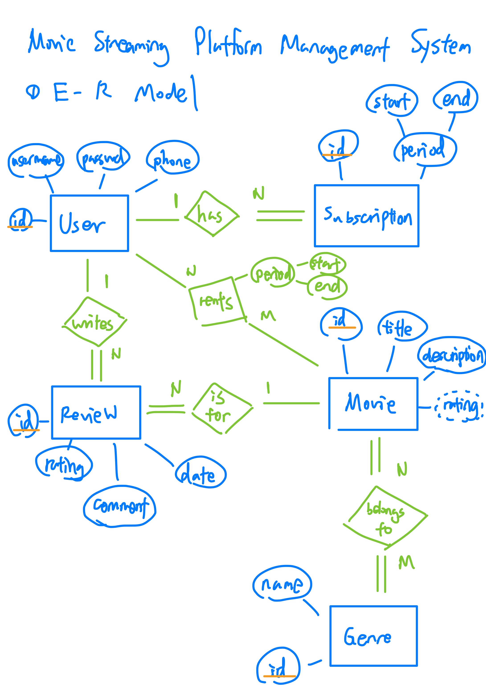

# Moving Streaming Platform Management System
This repo is my final project for the course "database systems" in NCCU.

## Caveat
Please note that code in this repo is intended solely for demo purposes and is susceptible to various bugs. Please DO NOT use it in practice!

## E-R Diagram

## Relational Schema

